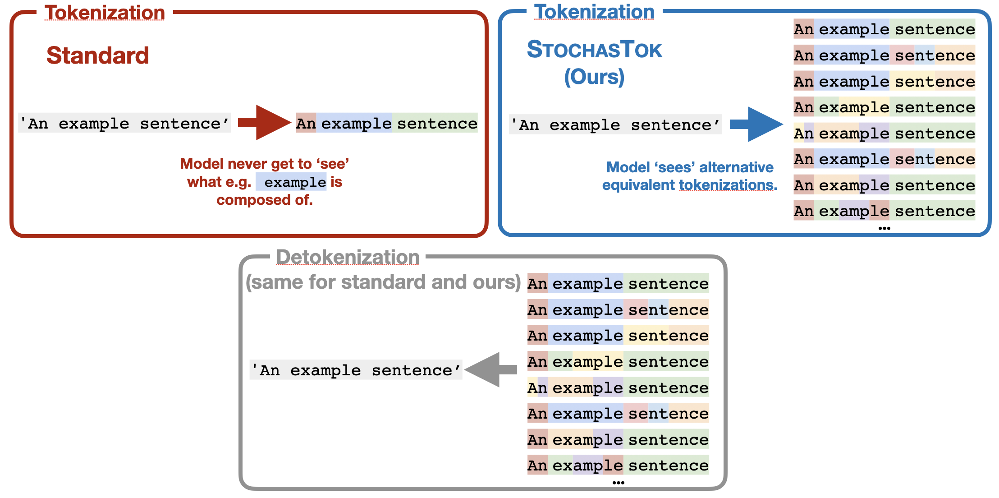
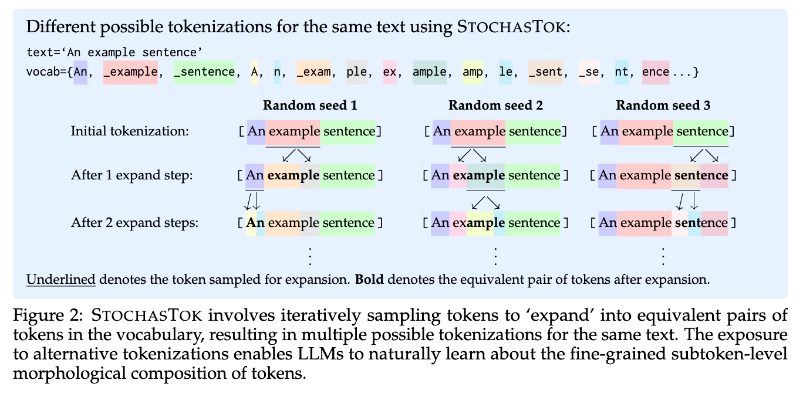
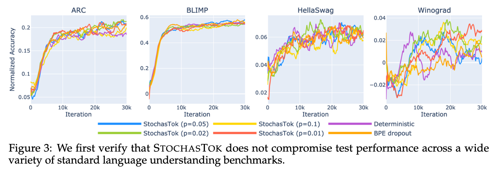
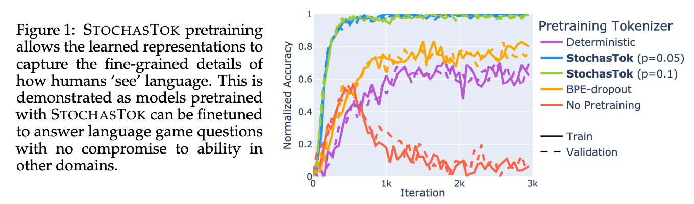
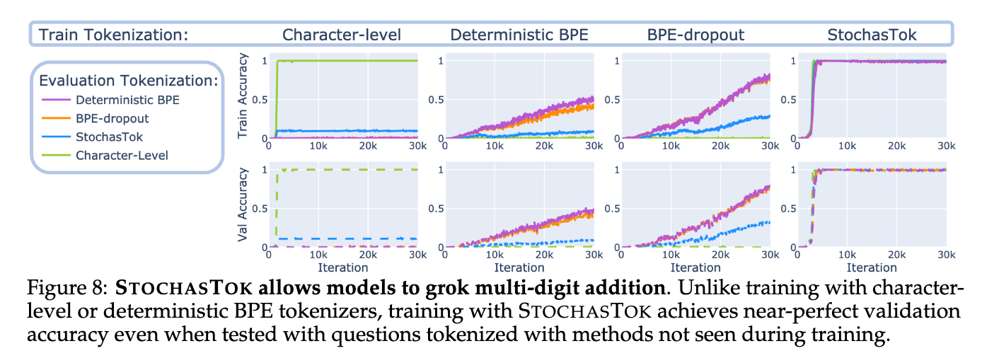
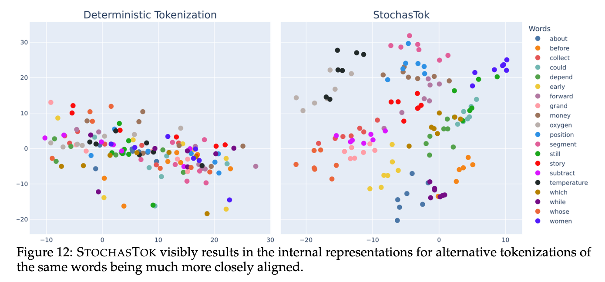

<div align="center">

# StochasTok: Improving Fine-Grained Subword Understanding in LLMs

[Anya Sims](https://anyasims.github.io/), [Thom Foster](https://thom.fyi/), [Klara Kaleb](https://scholar.google.com.vn/citations?user=11qgBWAAAAAJ&hl=id), [Tuan-Duy H. Nguyen](https://duynht.github.io/), [Joseph Lee](https://jleechung.github.io/), [Jakob N. Foerster](https://x.com/j_foerst), [Yee Whye Teh](https://scholar.google.com/citations?user=y-nUzMwAAAAJ&hl=en), [Cong Lu](https://www.conglu.co.uk/)

[](https://arxiv.org/pdf/2503.20783)
[](https://github.com/anyasims/stochastok)
[](https://x.com/cong_ml/status/1932369418534760554)

<div align="center" style="font-family: Arial, sans-serif;">
  <p>
     Code links: 
    <a href="stochastok_processor.py" style="text-decoration: none; font-weight: bold;">🌱 StochasTok</a> •
    <a href="dataset_preprocessing" style="text-decoration: none; font-weight: bold;">🛠️ Dataset Preprocessing</a> •
    <a href="configs" style="text-decoration: none; font-weight: bold;">⚙️ Configs</a>
  </p>
  <p>
     README links:
    <a href="#experiments" style="text-decoration: none; font-weight: bold;">💻 Experiments </a> •
    <a href="#citation" style="text-decoration: none; font-weight: bold;">🔥 TL;DR</a> •
    <a href="#citation" style="text-decoration: none; font-weight: bold;">🌼 Citation</a>
  </p>
</div>

</div>

<p align="center">
  
</p>

# Experiments

 Instructions for running the following experiments can be found below:
1. [Pretraining with and without StochasTok](###pretraining)
2. [Instruction finetuning on LangGame](##langgame-finetuning)
3. [Training on multi-digit addition with different tokenizations](##multi-digit-addition-training)

## Setup

To start, clone the repository and install requirements with:

```bash
# Clone repository
git clone https://github.com/anyasims/stochastok.git && cd stochastok
# Install requirements in virtual environment "stochastok"
conda create -n stochastok python=3.10
conda activate stochastok
pip install -r requirements.txt
```

## Pretraining

#### Tokenize the dataset

Training uses tokenized data saved as `memmap` files in `data/data_as_memmaps/xxx`. To tokenize the data:

1. First tokenize using the base tokenizer (or download pretokenized dataset from huggingface if `get_pretokenized_from_hf == True`):
```bash
python dataset_preprocessing/tokenize_dataset.py \
        --hf_dataset_name Skylion007/openwebtext \  # huggingface dataset name
        --data_dir ./data \                         # directory to save dataset
        --get_pretokenized_from_hf True \           # optionally download pretokenized dataset
        --save_to_hf True \                         # save tokenized dataset to huggingface
        --hf_username XXX \                         # huggingface username (required if `save_to_hf`)
```
e.g this will save the data to `data/data_as_memmaps/openwebtext-tokenized`

2. Then (optionally) apply StochasTok (or download pre-stochastok-expanded dataset from huggingface if `get_preexpanded_from_hf == True`):
```bash
python dataset_preprocessing/stochastok_expand_dataset.py \
        --hf_dataset_name Skylion007/openwebtext \  # huggingface dataset name
        --data_dir ./data \                         # directory to save dataset
        --get_preexpanded_from_hf True \            # optionally download pretokenized dataset
        --save_to_hf True \                         # save tokenized dataset to huggingface
        --hf_username XXX \                         # huggingface username (required if `save_to_hf`)
        --expand_prop 0.1                           # stochastok hyperparameter
```
e.g this will save the data to `data/data_as_memmaps/openwebtext-tokenized-stochastok0.1`

#### Run training
Then train the model with:
```bash
python train.py --config-name pretraining \
        trainer.dataset.name=openwebtext-tokenized
```
Change the dataset e.g. to `trainer.dataset.name=openwebtext-tokenized-stochastok0.1` etc. to use StochasTok. (The number of `trainer.training.gradient_accumulation_steps` are divided over the available GPUs.)

## LangGame finetuning

#### Generate the data
```bash
python dataset_preprocessing/make_langgame_dataset.py
```
This generates the LangGame dataset and saves the tokenized data to `data/data_as_memmaps/langgame` (used for training), and the untokenized dataset to `data/data_as_datasets/langgame` (used for eval).
#### Run training
```bash
python train.py --config-name instruction_tuning \
        trainer.checkpoint_name=<xxx>                   # name of checkpoint in ./checkpoints/
```
This trains the model on `data/data_as_memmaps/langgame`. `trainer.dataset.is_instruction` is set to `True` since it's a question-answering dataset.

## Multi-digit addition training

#### Generate the data
```bash
python dataset_preprocessing/make_multi_digit_addition_dataset.py
```
This generates the multi-digit addition datasets `multi_digit_addition_base`, `multi_digit_addition_stochastok`, and `multi_digit_addition_character`.
#### Run training
```bash
python train.py --config-name pretraining \
        trainer.dataset.name=multi_digit_addition_base \
        'trainer.eval=[{evaluator:"math_generation",num_samples:100}]'
```

#
Use `trainer.dataset.name=multi_digit_addition_base` for standard tokenization,
`trainer.dataset.name=multi_digit_addition_stochastok` for StochasTok tokenization,
or `trainer.dataset.name=multi_digit_addition_character` for character-level tokenization.

# TL;DR

<div align="center">

**Instead of standard tokenization... use stochastic tokenization!**



&nbsp;

**There is no compromise to original performance.**



&nbsp;

**It dramatically improves downstream performance on language game tasks**



&nbsp;

**StochasTok-trained models grok multi-digit addition**



&nbsp;

**And it visibly alters LLMs' internal representations**

</div>

&nbsp;

***For more results please see our [paper](https://github.com/anyasims/stochastok-preview/blob/main/stochastok-preview.pdf)!***

- StochasTok can be applied without pretraining from scratch,
- Is robust to hyperparameter choice,
- Has OOD generalization properties,
- Scales to larger models,
- and more...

# Citation

```
@misc{sims2025stochastokimprovingfinegrainedsubword,
      title={StochasTok: Improving Fine-Grained Subword Understanding in LLMs}, 
      author={Anya Sims and Thom Foster and Klara Kaleb and Tuan-Duy H. Nguyen and Joseph Lee and Jakob N. Foerster and Yee Whye Teh and Cong Lu},
      year={2025},
      eprint={2506.01687},
      archivePrefix={arXiv},
      primaryClass={cs.CL},
      url={https://arxiv.org/abs/2506.01687}, 
}
```

